# The game

The hero climbs a giant tree through **nine stages**: from branch to branch,
up ladders and vines, among apples, nests, doors in the trunk and spiders.

Each stage is a **script**: a list of three-byte entries —steps since the
previous one, type and column— that the cartridge uploads to VRAM at the start
and pulls out as you climb. One step is eight pixels, one row of cells. The
only thing not in the list is the trunk in the middle.

The pictures below **are neither captures nor the cartridge running**: they
are each stage's script fed through the cartridge's scenery step, rewritten in
Python (`tools/arbol.py`), stacking the middle row of the screen at every
step. Checked against openMSX, climbing each whole stage thirty steps at a
time: **0 cells different out of 104,832**.

## What each stage holds

| stage | steps | branches | apples | spiders | doors | sky |
|---|---|---|---|---|---|---|
| 1 | 451 | 98 | 21 | 5 | 10 | cyan |
| 2 | 493 | 98 | 15 | 12 | 8 | light green |
| 3 | 508 | 103 | 20 | 13 | 12 | light yellow |
| 4 | 498 | 103 | 23 | 14 | 12 | grey |
| 5 | 491 | 87 | 27 | 16 | 13 | black |
| 6 | 515 | 103 | 17 | 12 | 9 | light yellow |
| 7 | 549 | 110 | 26 | 19 | 14 | grey |
| 8 | 473 | 83 | 17 | 16 | 10 | black |
| 9 | 515 | 114 | 26 | 19 | 15 | black |

Stage 1 starts on the ground, by the river. The other eight start at the foot
of a hollow chamber in the trunk, a red section with two ladders at the top
and two at the bottom. All of them end with two red rows and two round
windows.

The colour of the sky is the stage's mask, `(0xE05D)`: the first stage's
comes from the initial values at `0x51C1`, and the others from the table at
`0x741F`.

## The nine stages

Bottom to top, the way they are climbed.

### Stage 1

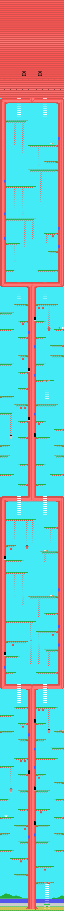

### Stage 2

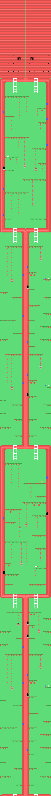

### Stage 3

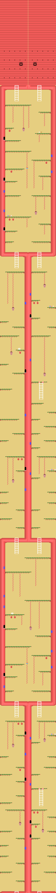

### Stage 4

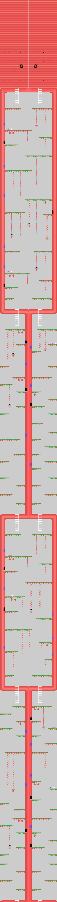

### Stage 5

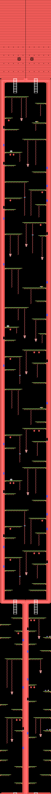

### Stage 6

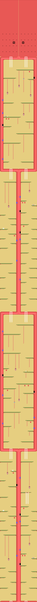

### Stage 7

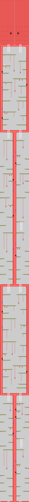

### Stage 8

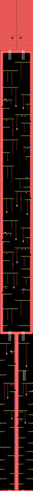

### Stage 9

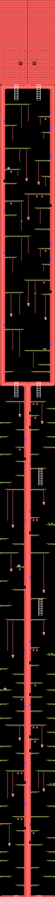

## The menu screens

Built from the ROM and checked against openMSX down to **0 bytes**.

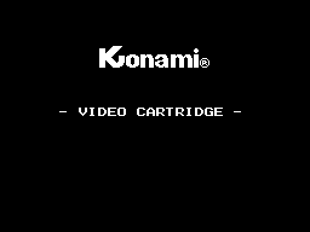

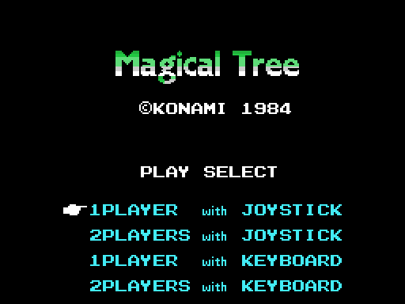
