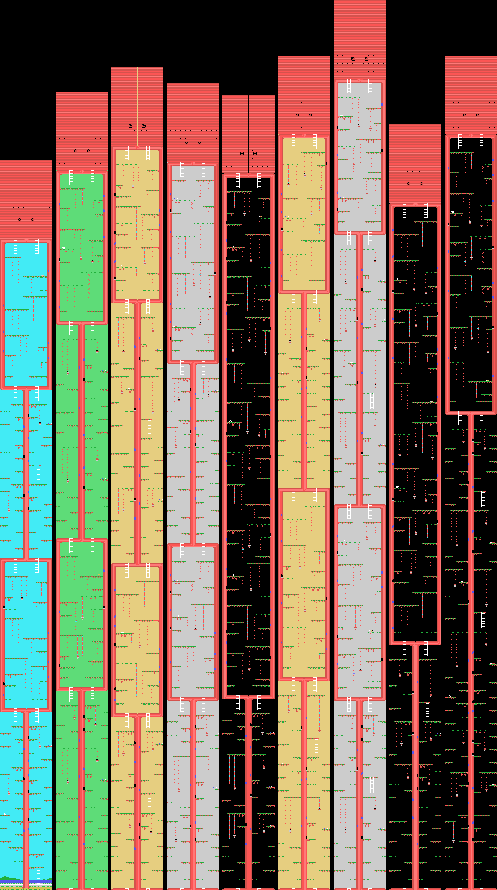
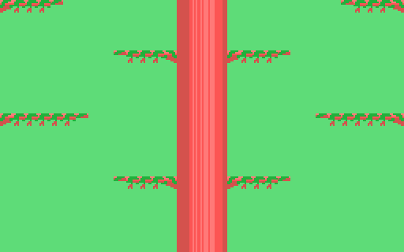
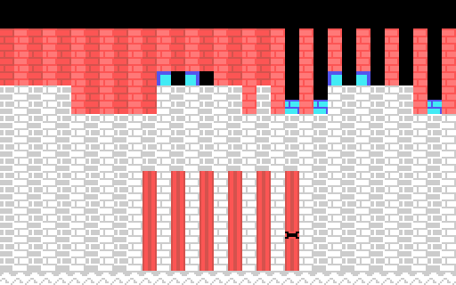

# El juego

El protagonista sube por un árbol gigante en **nueve fases**: de rama en rama,
por escaleras y lianas, entre manzanas, nidos, puertas del tronco y arañas.

Cada fase es un **guion**: una lista de entradas de tres bytes —pasos desde la
anterior, tipo y columna— que el cartucho sube a la VRAM al empezar y va
sacando según se trepa. Un paso son ocho píxeles, una fila de celdas. Lo único
que no viene en la lista es el tronco del centro.

Las imágenes de abajo **no son capturas ni el cartucho ejecutándose**: son el
guion de cada fase pasado por el paso del decorado del cartucho, escrito en
Python (`tools/arbol.py`), apilando la fila del medio de la pantalla en cada
paso. Cotejadas contra openMSX, subiendo cada fase entera de treinta en treinta
pasos: **0 celdas distintas en 104.832**.

## Lo que trae cada fase

| fase | pasos | ramas | manzanas | arañas | puertas | cielo |
|---|---|---|---|---|---|---|
| 1 | 451 | 98 | 21 | 5 | 10 | cian |
| 2 | 493 | 98 | 15 | 12 | 8 | verde claro |
| 3 | 508 | 103 | 20 | 13 | 12 | amarillo claro |
| 4 | 498 | 103 | 23 | 14 | 12 | gris |
| 5 | 491 | 87 | 27 | 16 | 13 | negro |
| 6 | 515 | 103 | 17 | 12 | 9 | amarillo claro |
| 7 | 549 | 110 | 26 | 19 | 14 | gris |
| 8 | 473 | 83 | 17 | 16 | 10 | negro |
| 9 | 515 | 114 | 26 | 19 | 15 | negro |

La fase 1 empieza en el suelo, junto al río. Las otras ocho empiezan al pie de
una sala hueca del tronco, un tramo rojo con dos escaleras arriba y dos abajo.
Todas acaban con dos filas rojas y dos ventanas redondas.

El color del cielo es la máscara de la fase, `(0xE05D)`: la de la primera sale
de los valores iniciales de `0x51C1`, y las demás de la tabla de `0x741F`.

## Las nueve fases

De abajo arriba, como se suben. Primero las nueve juntas, apoyadas en el suelo,
y después cada una a tamaño completo.

### Fase 1

### Fase 2

### Fase 3

### Fase 4

### Fase 5

### Fase 6

### Fase 7

### Fase 8

### Fase 9

## Entre fase y fase, y el castillo

Al cambiar de fase, `0x7629` pinta un árbol de 32 columnas **del centro hacia
fuera**, con los colores de la fase que empieza. Al acabar la novena pinta el
castillo, y encima las ventanas de `0x7600` con los dos personajes y el rótulo.
Los dos cotejados contra openMSX a **0 bytes**.

## Las pantallas de menú

Montadas desde la ROM y cotejadas contra openMSX a **0 bytes**.

